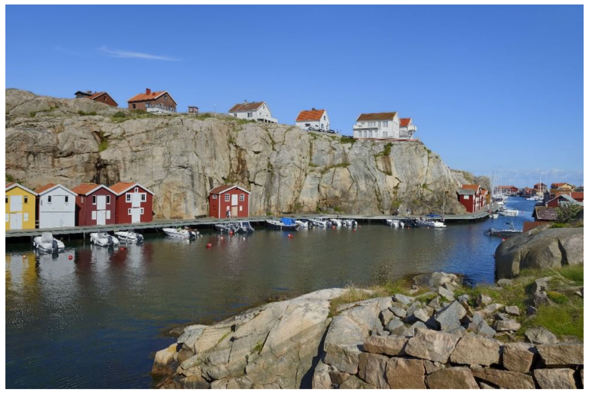
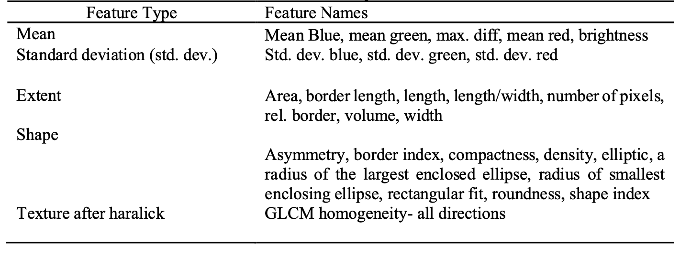
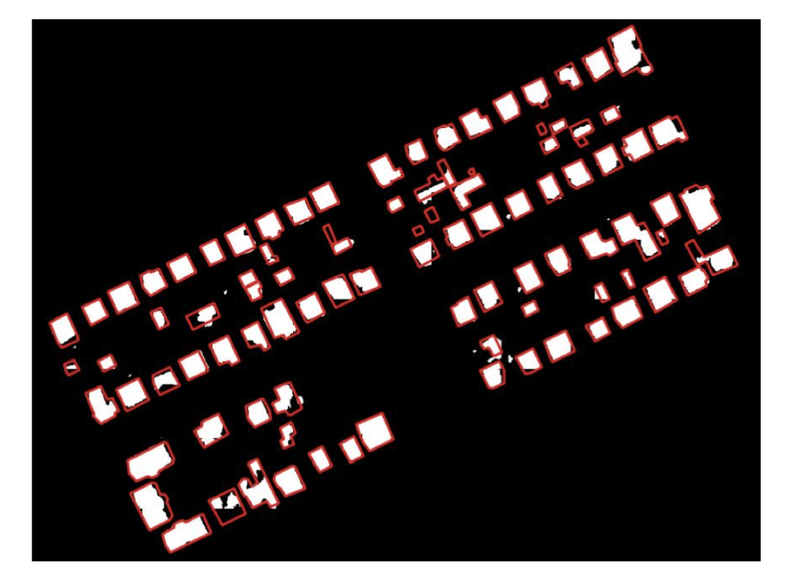
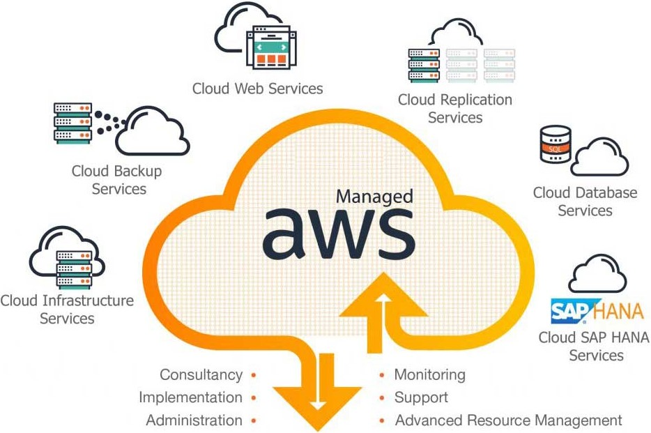
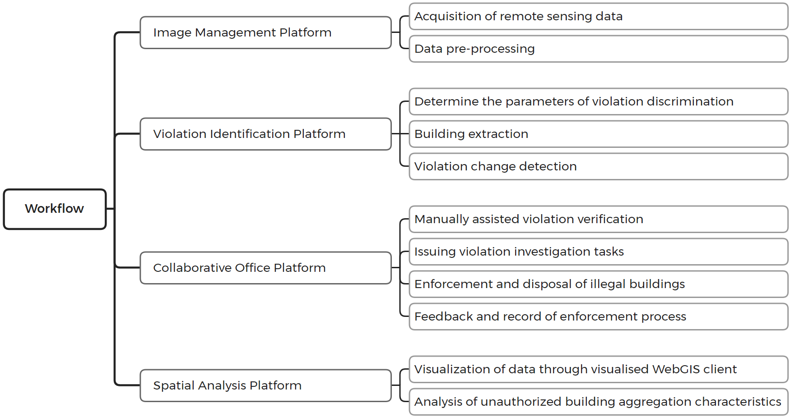
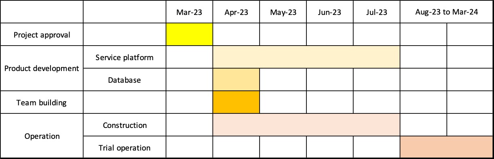
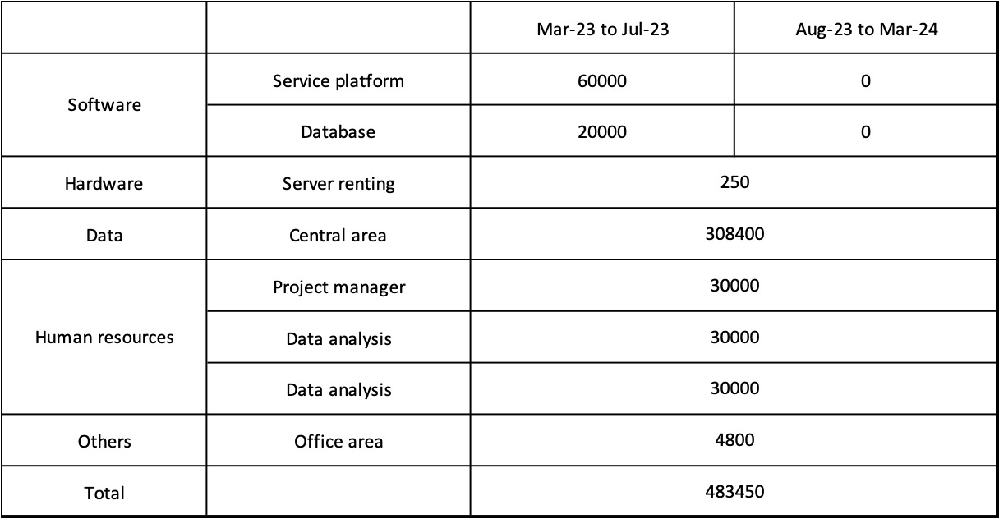
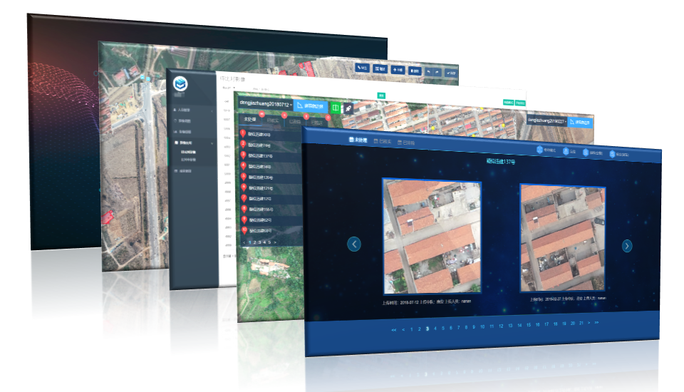

class: inverse, center, title-slide, middle

```{r include=FALSE, warning=FALSE}
library(countdown)
library(xaringan)
library(xaringanExtra)
library(knitr)
library(RefManageR)
library(knitcitations)
library(xaringanthemer)

style_mono_accent(base_color = "#752e31")
```

```{r xaringanExtra-search, echo=FALSE}
xaringanExtra::use_search(show_icon = TRUE)
```

```{r load_packages, message=FALSE, warning=FALSE, include=FALSE}
library(fontawesome)
```

```{r xaringan-panelset, echo=FALSE}
xaringanExtra::use_panelset()
```

```{r setup, include=FALSE}
options(htmltools.dir.version = FALSE)
BibOptions(check.entries = FALSE, bib.style = "authoryear",cite.style = "authoryear", style = "markdown", hyperlink = TRUE, dashed = TRUE, no.print.fields=c("doi", "url", "urldate", "issn"))
myBib <- RefManageR::ReadBib("Bib.bib")
```

background-image: url("img/cover.png")
background-size: cover
background-position: center

# Rapid Identification Platform for Urban Illegal Buildings Based on Remote Sensing in Istanbul

### *CASA0023 Group Presentation*

### osyz

#### `r format(Sys.time(), "%d/%m/%Y")`

---

class: inverse, center, middle

# *Outline*


### City Problem
### Approach
### Workflow
### Project Management
### Conclusion

---

class: inverse, center, middle

# City Problem

---

class: left, left
## City Problem
#### Brief summary of illegal buildings problem
* <font size = 3> With the **rapid urbanization** around the world, **illegal building is one of the crucial problem happened or still happening in many other countries** `r Citep(myBib,"akrofiSustainableUrbanDevelopment2019b","romanoIllegalBuildingItaly2021a")`.

* <font size = 3> The problem of **illegal buildings in Turkey**, which **was brought to wide attention by the devastating earthquake in early February this year again**, is a very serious and unsustainable development issue, and its impact is huge `r Citep(myBib,"uzunUpgradingIllegalSettlements2015a")`.

* <font size = 3> **Istanbul**, Turkey's largest and most populous city, **also faced significant challenges related to illegal buildings**. The city has struggled to cope with urbanization and growing demand for housing, which has led to uncontrolled and informal buildings.

.pull-left[
* **Illegal buildings: **
<font size = 3> Buildings located in Turkey without permission and registration and does not conform to the local urban cadastral plan `r Citep(myBib,"bayraktarLANDREGISTRYCADASTRE2006a","uzunUpgradingIllegalSettlements2015a")`
]
.pull-right[
```{r echo=FALSE, out.width='80%', fig.align='center'}
knitr::include_graphics('img/earthquake_image.jpg')
```
.small[Fig. Buildings after earthquake in Turkey February, 2023.
Source: [**BBC**](https://www.bbc.co.uk/news/64568826)
]
]

---

class: left, left

### City Problem

#### Negative Impact of illegal buildings

.panelset[
.panel[.panel-name[Environment]
* **Encroachment on nature:** nature reserves, rivers, forests `r Citep(myBib,"jovanovicEnvironmentalImpactIllegal2019a")`
```{r echo=FALSE, out.width='60%', fig.align='center'}

```
.small[Fig. Illegal buildings close to river.
Source: `r Citet(myBib,"feliceRankingIllegalBuildings2019a")`
]
]

.panel[.panel-name[Economic]
* Exacerbating urban **poverty and high unemployment rate** `r Citep(myBib,"ahsanInformalHousingApproaches2010a")` 

* Undermine **tourism development** `r Citep(myBib,"ozdemirIzmirDestinasyonuNda2018a")`

* Distorting markets and creating **unfair competition**

]

.panel[.panel-name[Society and population]
* **Huge inter migration** `r Citep(myBib,"zanfiCittaAbusivaContemporary2013a")`

* **Social safety issue:** disturb the social order, which makes government to be difficult to plan and manage `r Citep(myBib,"peroldArchitectureSouthernAfrican2019a","romanoIllegalBuildingItaly2021a")`

* **Human safety issue:** the quality of illegal buildings can not be guaranteed and may threaten the life and health of residents (e.g.earthquake, flood, etc) `r Citep(myBib,"hortonTurkeyEarthquakeWhy2023a")`

* **Property of society and human** cannot be guaranteed: higher crime rate `r Citep(myBib,"varolDetectionIllegalConstructions2019a")`
]
]

---

class: left, left

### City Problem

#### Relevant global and local policy

.panelset[
.panel[.panel-name[Global policy]

**1.United Nation: The Sustainable Development Goals (SDGs)**
* .small[**Goal 11:** ***"Make cities and human settlements inclusive, safe, resilient, and sustainable."***]
* .small[Target 11.1: By 2030, ensure access for all to adequate, safe and affordable housing and basic services and upgrade slums]
* .small[Indicator 11.1.1: Proportion of urban population living in slums, informal settlements or inadequate housing]

**2.United Nation: The New Urban Agenda**
* .small[Increase the allocation of financial and human resources, as appropriate, to ***address the problem of illegal construction in a sustainable manner*** so that residents live in safe, inclusive, accessible, green and quality Spaces, and should promote tenure security and its regularization, as well as conflict prevention and timely mediation.]
]

.panel[.panel-name[National policy]

#### **1.2012-"The urban regeneration law"**

*  A legal framework for the renewal and restoration and protection of cultural sites in areas considered unsafe or substandard in urban centers. It also includes <font color black> ***measures to tackle illegal buildings, such as property and legal alternatives for residents living in illegal structures where unsafe structures are demolished.***


#### **2.Construction Law (İmar Kanunu in Turkish) Article 42**

* Stricter building codes and ***increased fines and penalties for violators.***
.panel[.panel-name[City policy]
**1.Urban Planning Training and Capacity Development Programme for Resilient Istanbul:**

* Aims to support capacity development for the “Next Generation Participatory Planning Framework” in urban planning processes of the Municipality based on open government vision.
]
]
]

---

class: inverse, center, middle

# Approach

---

### Data

.pull-left[
**WorldView-3**
- Very High Resolution(VHR)
  - Multispectral(R,G,B,NIR) 1.24m
- Revisits less than one day
- Standard image products available
  - radiometrically corrected
  - sensor corrected
  - orthorectified and projected to the Earth’s Surface.
  
**Cadastral Digital Map**
- Land Registry and Cadastre Information System in Turkey
- Provide ownership and cadastral information in land registry
]

.pull-right[
```{r echo=FALSE, fig.align='center'}
knitr::include_graphics('img/worldview3.jpeg')
```
.small[Figure.WorldView3 imagery. Source:[DigitalGlobe](https://worldview3.digitalglobe.com/)]

]

---

### Object-based Image Analysis

.panelset[
.panel[.panel-name[Image Segmentation]
**Multi-resolution segmentation(MRS)**
  - Extract reasonable objects that can be used in next steps
  
  - Three parameters to partition an image into objects: scale, shape, and compactness. 
  
**Spectral difference segmentation**
  - Merge neighboring image objects
  
    - if the difference between their layer mean intensities lower than the value given by the maximum spectral difference
  ]
  
.panel[.panel-name[Feature Selection]

27 features selected within eCognition for each object

```{r echo=FALSE}

```
]

.panel[.panel-name[Classification]
Support Vector Machine with optimum feature selection to classify the objects as buildings or non-buildings(forest, green area, road and water). 

```{r echo=FALSE,, out.width='80%', fig.align='center'}
knitr::include_graphics('img/classification.png')
```
.small[Figure.Classification using SVM.Source:`r Citep(myBib,"Norman_2021")` ]

]
]

---

### Identifying Illegal Buildings

.pull-left[

Compare the buildings in the classification map with cadastral digital map
  - The buildings that are contradict to cadastre would be identified illegal.


### Validation

- Visit the sites of the identified buildings
- Verify their legality using on-site inspections or by consulting with local authorities
]

.pull-right[

```{r echo=FALSE, out.width='120%'}

```
.small[Figure.Ground truth cadastral data overlap with results. Source: `r Citep(myBib,"rs13163150")`]
]

---

class: inverse, center, middle

# Workflow

---

### Hardware preparation

.pull-left[

#### Component
The hardware infrastructure of the identification platform needs to be built, including *storage devices, computing devices, network devices, security devices*, etc. 

#### Service choice
However, in the early stage when the business scale is small, cloud servers, such as ***Amazon Web Services (AWS)***, can be used first. In the distant stage when the business scale expands a lot, the construction of local servers can be considered.
]

.pull-right[

```{r echo=FALSE, out.width='100%'}

```
.small[ Fig. Amazon Web Services (AWS). Source:[Milletech](https://www.milletechinc.com/aws-service-atlanta.html)]
]

---

### Database construction

#### Remote sensing database
Store the acquired remote sensing image data on the server, and construct the ***remote sensing database*** after data pre-processing such as slicing and stitching. 

#### Basic geographic and planning database
Acquire data through relevant channels and construct a ***basic geographic and planning database***, containing TAKBIS (Land Registry and Cadastre Information System in Turkey), topography, structures, planning data, etc. 

#### Process database
Afterwards, using the data processing and analysis methods described above, unauthorised construction is identified and the resulting possible unauthorised construction sites are compared with the recorded registration data and planning data to identify unauthorised construction sites based on laws and regulations and to build a ***process database***.

---

### Use of the service platform

Based on each database, the image management platform, violation identification platform, collaborative office platform and spatial analysis platform are developed and integrated into ***one service platform***, and ***a visualised WebGIS client*** is established using the 3D model of the city to facilitate the use of the management staff. Based on this service platform, illegal buildings sites are investigated and dealt with.

.panelset[
.panel[.panel-name[Management]
***The image management platform*** provides management services for remote sensing image data.
]
 
.panel[.panel-name[Identification]
***The violation identification platform*** allows users to modify violation identification rules and provide feedback information after on-site investigation.
]

.panel[.panel-name[Office]
***The collaborative office platform*** provides office services such as violation point reporting, querying, processing and recording so that managers from different departments can clearly remedy violation points.
]

.panel[.panel-name[Analysis]
***The spatial analysis platform*** can analyse the spatial distribution characteristics of violation data in the city so that the construction of violation can be restricted in a more root cause manner at the macro policy level.
]
]

---
### Use of the service platform

#### Service platform workflow

```{r echo=FALSE, out.width='100%'}

```

---

### Subsequent upgrades

#### Function

The application of remote sensing data in the field of investigating and dealing with urban violations is not limited to illegal buildings, but can also be applied to ***urban river encroachment***, ***loss of urban greenery***, ***illegal industrial discharge*** and so on. The platform has a complete process system, and these functions can be added to the platform and be used directly.

#### Grid management of remote sensing image data

Due to financial constraints, in the first phase, the analysis was conducted only for the central urban areas and areas with a high incidence of building violations.

In the long term, ***high frequency (once a month)*** of remote sensing data acquisition can be adopted for urban central areas and areas with high prevalence of illegal buildings, and ***low frequency (once every two months)*** can be adopted for suburban areas and areas with low prevalence of illegal buildings, so that the detection of illegal buildings can be carried out with the highest efficiency.

---

class: inverse, center, middle

# Project Management

---

### Work package

- **Package 1**

  - Meetings with stakeholders (government and public representatives)
  
  - Set questions
  
  - Establish projects


- **Package 2**

  - Collect data and establish a database
  
  - Build a service platform
  
  - Build a team


- **Package 3**

  - Deliver the software
  
  - Start trial operation

---

### Time

- Project approval: 15 days

- Platform construction: 4 months

- Trial operation: 1 months

- Total duration: 1 year

 

---

### Cost

- Data: 20 (£/km²) \* 2570 (km²) \* 6 (time) = 308,400 (£)



---

### Risk and solutions

1. **Social risk**:

  - Being resisted by local residents
  
  - Bring short-term social instability and negative economic benefits
  
  *Solution*:
  
  - Fully discussion and publicize in initial stages
  
  - Open platform for the public.
    
2. **Technical risk**:

  - Data failure
  
  - Staff turnover
  
  *Solution*:
  
  - Ensure the availability of alternative data sources and technical staff.
  
---

class: inverse, center, middle

# Conclusion

---


### Conclusion
A platform that can regularly monitor illegal buildings and assist on-site investigation of illegal buildings.

.small[Fig. Service platform. Source:[WEGIS](http://www.wegis.com.cn/#/illegalBuilding)]

---

### Benefit

- **Ensuring public safety**: Illegal building can lead to serious safety hazards for the occupants of the building and those in the surrounding area

- **Protecting property values**: Protect property values for residents and businesses in the area

- **Protect the environment**: Some illegal buildings are built in nature reserves, urban sewage pipes and other places of great environmental impact

- **Enforcing Building Codes and Regulations** : Deter future illegal building and encourage compliance with building codes and regulations

- **Save a lot of costs to deal with illegal buildings**

- **Save costs and reduce manpower**: Compared with traditional manual inspection, machine learning using remote sensing data reduces the time and labor required

- **Higher efficiency**: Testing is faster, allowing governments to respond more quickly

---


### Benefit

|policy | output | improvement
--------|---------|---------
International|The Sustainable Development Goals & The New Urban Agenda| the violation identification platform |reducing the proportion of the urban population living in slums, informal settlements or inadequate housing
National|Urban Regeneration Law & Construction Law|assist on-site investigation|enforcing building codes and regulations
City|Urban Planning Training and Capacity Development Programme for Resilient Istanbul|the collaborative office platform| ensure proactive participation of all inhabitants of Istanbul

---

### Limitation

- Illegal buildings that only change in height cannot be detected using this method.

- The method takes more time to continuously improve the accuracy.

---

class: left, left

### References

.small[
```{r, results='asis', echo=FALSE}
RefManageR::PrintBibliography(myBib,start = 1, end = 10)
```
]

---

class: left, left

### References

.small[
```{r, results='asis', echo=FALSE}
RefManageR::PrintBibliography(myBib,start = 11, end = 14)
```
]
